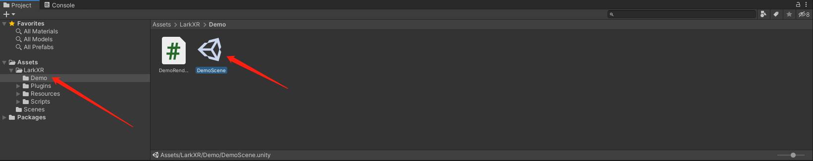

# LarkXR Unity3D Client SDK

---

[English](./README.md) [中文](./README.zh_CN.md)

---

## About

SDK for muti device, zspace phone ar or headset, LarkXR cloudrendering Unity3D client.

Cloud app use OpenVR/OpenXR plugin.

SDK contain LarkXR restful api, streaming decode, pose upload.

SDK out left/right eye cloudrendering decoded texture2d.

### Tested Device

- [:heavy_check_mark:] Windows X64
- [:heavy_check_mark:] Android Phone
- [:heavy_check_mark:] [Zspace (Win64)](https://zspace.com/)

Links：

[Paraverse](https://www.paraverse.cc/)

[LarkSR Doc](https://www.pingxingyun.com/devCenter.html)

[Experience](https://www.paraverse.cc/)

## Running


## QuickStart

1. Import LarkXR SDK pacakge


2. DemoScene



3. Config SDK ID

Open DemoRender.cs, find line 38.

```c#
// Your SDK ID 
string sdkID = "Your SDK ID ";

if (!XRApi.InitSdkAuthorization(sdkID)) {
    int errCode = XRApi.GetLastError();
    Debug.LogError("Init failed " + errCode);
}
```

4. Config with LarkXR Server address


With right config got running result.

## Interface

### XRManager

Mount XRManager script or call XRManager.Instance to auto mount and get XRManager singleton.

XRManager auto init.

> Set SDK ID first.

```c#
// 初始化 SDK ID 
string sdkID = "Your SDK ID";

if (!XRApi.InitSdkAuthorization(sdkID)) {
    int errCode = XRApi.GetLastError();
    Debug.LogError("Init failed " + errCode);
}
```

### Delegate

Delegate for connection state. Got remote texture.

onTexture2D,onTexture2DStereo Got remote texture. Left/Right or Both.

```c#
// Connection closed
XRManager.Instance.RenderManger.onClose += OnClose;
// Connection connected.
XRManager.Instance.RenderManger.onConnected += OnConnect;
// Left and right eye texture2d.
XRManager.Instance.RenderManger.onTexture2DStereo += OnTexture2DStrereo;
// Left and right eye with in one texture2d.
XRManager.Instance.RenderManger.onTexture2D += OnTexture2D;
```

### Send tracked pose

Use XRApi.UpdateDevicePose to update device pose.

Use XRApi.SendDeivcePair to send device pose to cloud.

Should send tracked pose to cloud after connected.

```c#
void Update()
{
    UpdateCamera();
    // Send every frame.
    if (XRApi.IsConnected())
    {
        UpdateCloudPose();
    }
}
```

```c#
OpenVrPose openVrPose = new OpenVrPose(hmd.transform);
openVrPose.Position.y += LarkXR.Config.GetExtraHeight();
XRApi.UpdateDevicePose(XRApi.DeviceType.Device_Type_HMD, openVrPose.Position, openVrPose.Rotation);
XRApi.SendDeivcePair();
```

> Cloud rendering use same coordinate system with OpenVr, See OpenVrPose turn Unity3D 
coordinate system to OpenVr coordinate system.

### Config

```c#
// config render.
XRApi.RenderInfo renderInfo = XRApi.GetDefaultRenderInfo();
renderInfo.renderWidth = 1920;
renderInfo.renderHeight = 1080;
renderInfo.fps = 60;
XRApi.SetRenderInfo(renderInfo);

// config bitrate
XRApi.SetupBitrateKbps(50 * 1000);

// config output texture type
XRApi.SetUseMultiview(true);
```

setup server IP

```c#
// update android server address;
XRApi.SetServerAddr(Config.GetServerIp(), Config.GetLarkPort());
```

> More: LarkXR/Scripts/UI/UIManager.cs

### Server Restful API

XRManager auto send get task request, got form delegate.

```c#
// got applist
XRManager.Instance.TaskManager.onApplistSuccess += OnApplistSuccess;
// got applist failed.
XRManager.Instance.TaskManager.onApplistFailed += OnApplistFailed;
```

> More LarkXR/Scripts/UI/UIManager.cs
